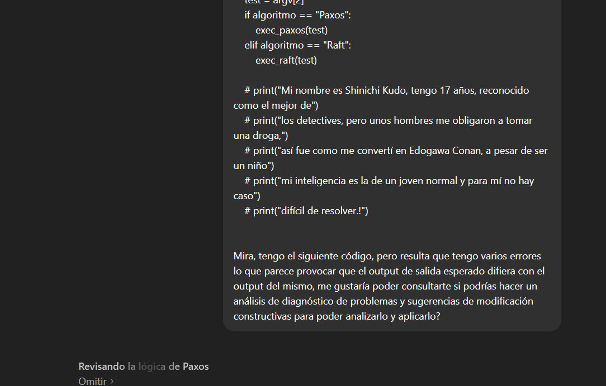
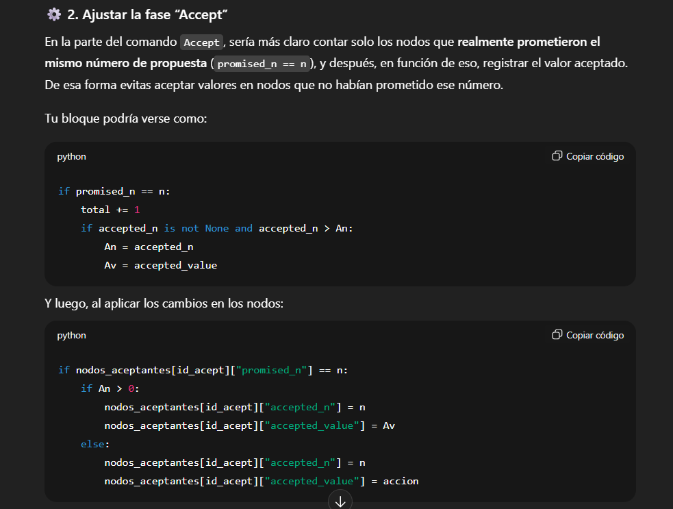
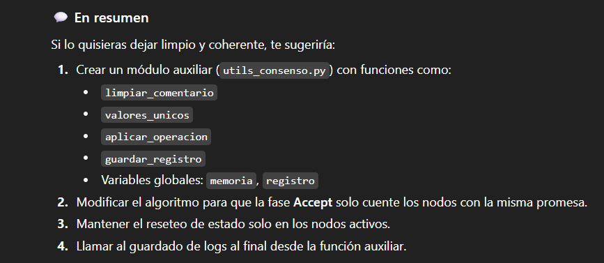

# Tarea 2 - Sistemas Distribuidos.

Integrantes:
 - Cristóbal Ignacio Albornoz Luengo.
 - Randall Fabrizio Biermann Olivari.
 - Fecha de Entrega: 06-10-2025

## Generalidades sobre el proceso de ejecución de tests

## 1. Ejecutar python3 main.py Paxos casos_Paxos/test_XX.txt
Al ejecutar los tests de Paxos, se tiene que todos devuelven el output esperado, por lo que cumplen con lo solicitado.

## 2. Ejecutar python3 main.py Raft casos_Raft/test_01.txt
>>>>>>>>>>>>>> COMPLETAR <<<<<<<<<<<<

## 3. Con respecto al uso de herramientas generativas de código
Se ha hecho uso de herramienta de generación de texto para usos muy específicos:
- Caso Paxos: Se utilizó ChatGPT para realizar depuración y testeo de errores. Sin embargo, todo el código
fue escrito por humanos, por lo que el uso que se le ha dado ha sido bien específico y concreto para poder
corregir errores, la interpretación de los mismos y aclaramiento de dudas, en complemento con la información
que se encuentra disponible en GitHub discussions. Sin embargo, ninguna de las salidas para el testing y debugeo entregadas
por el modelo de lenguaje se han utilizado de manera textual sin realizar modificaciones y adaptaciones.

- Caso Raft: >>>>>>>>>>>>>>> COMPLETAR <<<<<<<<<<<<<<<<<
